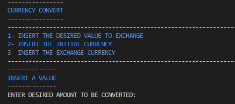
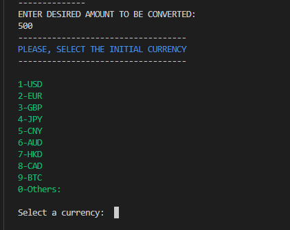
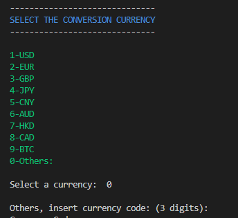
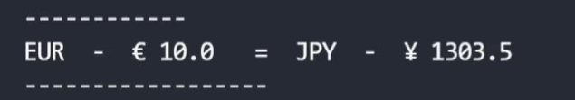
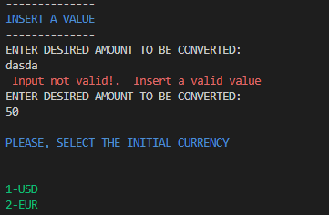
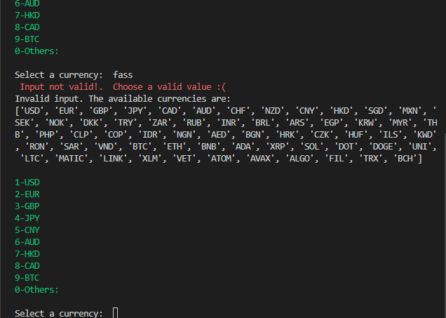
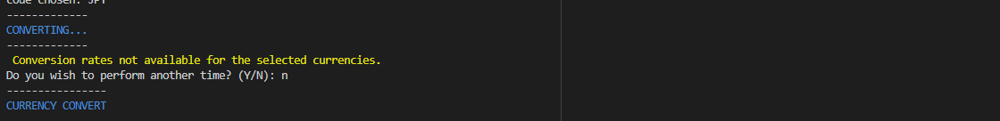
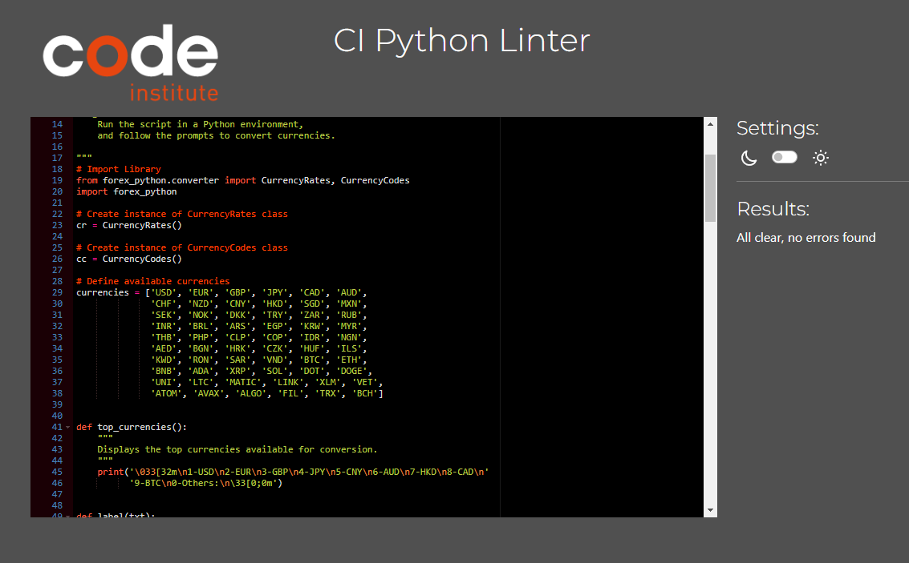

#  CurrencyConvert

**Diego Moro** 

💻 [Visit live website](https://currencyconverter.herokuapp.com/)

##About

A currency conversion program that allows the user to convert between different currencies.

This program uses the forex_python library to perform currency conversions. It allows the user to input a desired amount to be converted, the initial
currency and the exchange currency. It provides a list of currencies to choose from and displays the converted amount.

## Table of Contents
  - [Project Goals](#project-goals)
    - [User Goals](#user-goals)
    - [Site Owner Goals](#site-owner-goals)
  - [User Experience](#user-experience)
    - [Target Audience](#target-audience)
    - [User Requirements and Expectations](#user-requirements-and-expectations)
  - [User Stories](#user-stories)
    - [Users](#users)
    - [Site Owner](#site-owner)
  - [Technical Design](#technical-design)
    - [Flowchart](#flowchart)
  - [Technologies Used](#technologies-used)
    - [Languages](#languages)
    - [Frameworks & Tools](#frameworks--tools)
    - [Libraries](#libraries)
  - [Features](#features)
  - [Validation](#validation)
  - [Testing](#testing)
    - [Manual Testing](#manual-testing)
    - [Automated Testing](#automated-testing)
  - [Bugs](#bugs)
  - [Deployment](#deployment)
  - [Credits](#credits)
  - [Acknowledgements](#acknowledgements)

## Project Goals

### User Goals

- Check the value and quote in differents currencies
- Have a clean app and easy to use
- Fast and accurate

### Site Owner Goals

- Create a app that is easy and clear to user
- Ensure that users understand the purpose of the app
- Display the informations to make a easy understanding
- Give an accurate and fast quotation

## User Experience

### Target Audience

For those who wants to follow the prices find the best time to buy or sell your forigien currencies.

### User Requirements and Expectations

- A simple, error-free app
- Straightforward navigation
- Accurate
- Fast

[Back to Table Of Contents](#table-of-contents)

## User Stories

### Users

1. I want to have easy access to the top currencies
2. I want to be able to see the instructions
3. I want to have access to diffetent currencies
4. I want to receive a real time quotation

### Site Owner

5. I want users to have a positive experience
6. I want users to easily select options from the menu
7. I want users to see and follow the instruction for a easy navigation
8. I want the user to receive a real time result

                    ## Technical Design

                    ### Flowchart

                    The following flowchart summarises the structure and logic of the application.

                    

Flowchart

                    
                    

## Technologies Used

### Languages

- [Python](https://www.python.org/) Programming language for the logic of the program

### Frameworks & Tools

- [Diagrams.net](https://app.diagrams.net/) was used to draw program flowchart
- [Git](https://git-scm.com/) was used for version control within VSCode to push the code to GitHub
- [GitHub](https://github.com/) was used as a remote repository to store project code
- [PEP8](http://pep8online.com/) was used to check my code against Python conventions
- [Heroku](https://heroku.com/) was used to deploy the project into live environment
- [Visual Studio Code (VSCode)](https://code.visualstudio.com/)

### Libraries

#### Python Libraries
- [forex-python](https://pypi.org/project/forex-python/) Forex Python is a Free Foreign exchange rates and currency conversion

[Back to Table Of Contents](#table-of-contents)

## Features

### Informantions

- Provides user the steps to follow
- Gives a fast and easy navagation to users
- User stories covered: 2, 7
 

    
Instructions Screenshot

### Top Currencies
- Displays a list of top currencies
- Allows user to find easily the most popular currencies
- User stories covered: 1, 6
  

    
Top currencies Screenshot

### Extra Currencies
- Gives a big list of currencies coverd
- User stories covered: 3

    
Extra currancies Screenshot

### Result
- Gives result in real time exchange rate
- User stories covered: 4, 8

    
Result Screenshot

### User Input Validation
- Displays an error message if user input is not in a form that was expected
- Asks for a new input and provides guidance to user on how to correctly format the input
- User stories covered: 5

    
input validation Screenshot

    
Currency validation Screenshot

    
Conversion validation Screenshot

[Back to Table Of Contents](#table-of-contents)

## Validation

[PEP8 Validation](https://pep8ci.herokuapp.com/) was used to check the code for PEP8 requirements. All the code passes with no errors and no warnings to show.

PEP3 check for run.py

## Testing

The testing approach is as follows:
1. Manual testing of user stories
2. Automated unit testing using the Python unittest library

### Manual Testing

See user stories testing

1. I want to have easy access to the top currencies

| **Feature**   | **Action**                    | **Expected Result**          | **Actual Result** |
| ------------- | ----------------------------- | ---------------------------- | ----------------- |
| Top Currencies | User can select or press 0 to pick an expecific one  | easy access | Works as expected |

Screenshot

2. I want to be able to see the instructions

| **Feature**   | **Action**                    | **Expected Result**          | **Actual Result** |
| ------------- | ----------------------------- | ---------------------------- | ----------------- |
| Instructions | follow the steps | easy understandin fast navigation | Works as expected |

Screenshot

3. I want to have access to diffetent currencies

| **Feature**   | **Action**                    | **Expected Result**          | **Actual Result** |
| ------------- | ----------------------------- | ---------------------------- | ----------------- |
| Extra Currencies | We users press 0 they can choose a larger list of currencies  | easy access | Works as expected |

Screenshot

4. I want to receive a real time quotation

| **Feature**   | **Action**                    | **Expected Result**          | **Actual Result** |
| ------------- | ----------------------------- | ---------------------------- | ----------------- |
| Result | follow instrction set an amount, initial currency and currency to exchange | it gives a real time result  | Works as expected |

Screenshot

5. I want users to have a positive experience

| **Feature**   | **Action**                    | **Expected Result**          | **Actual Result** |
| ------------- | ----------------------------- | ---------------------------- | ----------------- |
| Input Validation | Invalid data | Feedback message with instructions diplayed to the user  | Works as expected |

Screenshot

6. I want users to easily select options from the menu

| **Feature**   | **Action**                    | **Expected Result**          | **Actual Result** |
| ------------- | ----------------------------- | ---------------------------- | ----------------- |
| Top Currencies | List of top popular currencies | easy fast access  | Works as expected |

Screenshot

7. I want users to see and follow the instruction for a easy navigation

| **Feature**   | **Action**                    | **Expected Result**          | **Actual Result** |
| ------------- | ----------------------------- | ---------------------------- | ----------------- |
| instruction | Follow the steps | For easy and fast understaanding  | Works as expected |

Screenshot

8. I want the user to receive a real time result

| **Feature**   | **Action**                    | **Expected Result**          | **Actual Result** |
| ------------- | ----------------------------- | ---------------------------- | ----------------- |
| Result | Follow instrction set an amount, initial currency and currency to exchange | it gives a real time result  | Works as expected |

Screenshot

