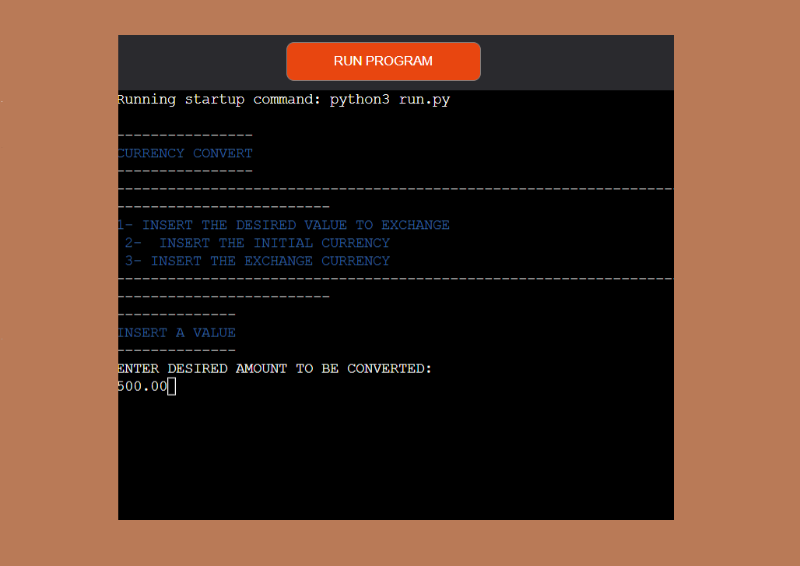

#  CurrencyConvert

**Diego Moro** 

💻 [Visit live website](https://currencyconverter.herokuapp.com/)

##About

A currency conversion program that allows the user to convert between different currencies.

This program uses the forex_python library to perform currency conversions. It allows the user to input a desired amount to be converted, the initial
currency and the exchange currency. It provides a list of currencies to choose from and displays the converted amount.

## Table of Contents
  - [Project Goals](#project-goals)
    - [User Goals](#user-goals)
    - [Site Owner Goals](#site-owner-goals)
  - [User Experience](#user-experience)
    - [Target Audience](#target-audience)
    - [User Requirements and Expectations](#user-requirements-and-expectations)
  - [User Stories](#user-stories)
    - [Users](#users)
    - [Site Owner](#site-owner)
  - [Technical Design](#technical-design)
    - [Flowchart](#flowchart)
  - [Technologies Used](#technologies-used)
    - [Languages](#languages)
    - [Frameworks & Tools](#frameworks--tools)
    - [Libraries](#libraries)
  - [Features](#features)
  - [Validation](#validation)
  - [Testing](#testing)
    - [Manual Testing](#manual-testing)
    - [Automated Testing](#automated-testing)
  - [Bugs](#bugs)
  - [Deployment](#deployment)
  - [Credits](#credits)
  - [Acknowledgements](#acknowledgements)

## Project Goals

### User Goals

- Check the value and quote in differents currencies
- Have a clean app and easy to use
- Fast and accurate

### Site Owner Goals

- Create a app that is easy and clear to user
- Ensure that users understand the purpose of the app
- Display the informations to make a easy understanding
- Give an accurate and fast quotation

## User Experience

### Target Audience

For those who wants to follow the prices find the best time to buy or sell your forigien currencies.

### User Requirements and Expectations

- A simple, error-free app
- Straightforward navigation
- Accurate
- Fast

[Back to Table Of Contents](#table-of-contents)

## User Stories

### Users

1. I want to have easy access to the top currencies
2. I want to be able to see the instructions
3. I want to have access to diffetent currencies
4. I want to receive a real time quotation
5. I want to have a clear result

### Site Owner

6. I want users to have a positive experience
7. I want users to easily select options from the menu
8. I want users to see and follow the instruction for a easy navigation
9. I want the user to receive a real time result
10. I want to provide access to user to the top currencies in the world

                    ## Technical Design

                    ### Flowchart

                    The following flowchart summarises the structure and logic of the application.

                    

Flowchart

                    
                    

## Technologies Used

### Languages

- [Python](https://www.python.org/) Programming language for the logic of the program

### Frameworks & Tools

- [Diagrams.net](https://app.diagrams.net/) was used to draw program flowchart
- [Git](https://git-scm.com/) was used for version control within VSCode to push the code to GitHub
- [GitHub](https://github.com/) was used as a remote repository to store project code
- [PEP8](http://pep8online.com/) was used to check my code against Python conventions
- [Heroku](https://heroku.com/) was used to deploy the project into live environment
- [Visual Studio Code (VSCode)](https://code.visualstudio.com/)

### Libraries

#### Python Libraries
- [forex-python](https://pypi.org/project/forex-python/) Forex Python is a Free Foreign exchange rates and currency conversion

[Back to Table Of Contents](#table-of-contents)

